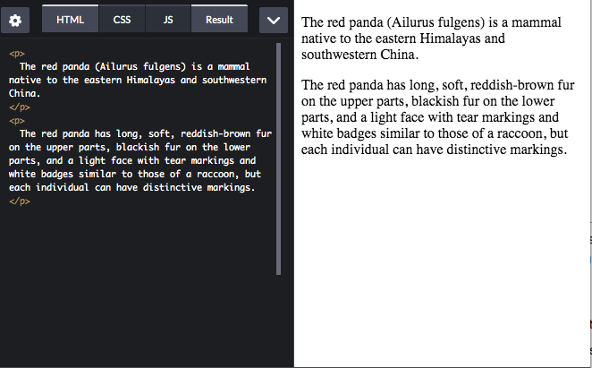
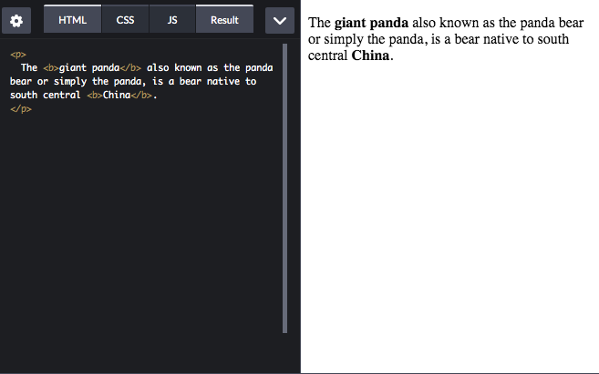
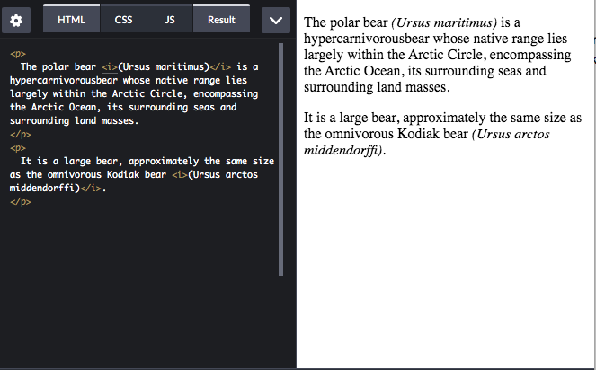
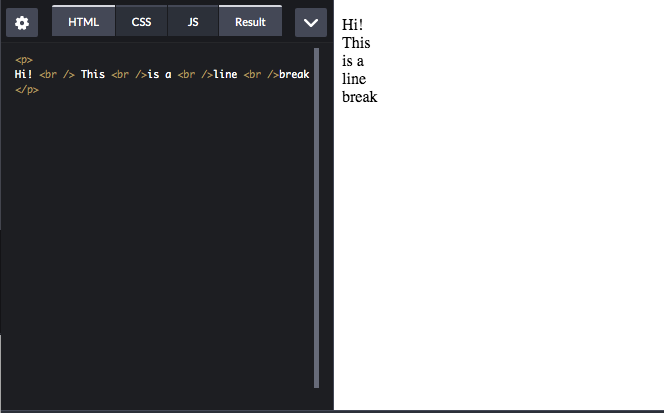
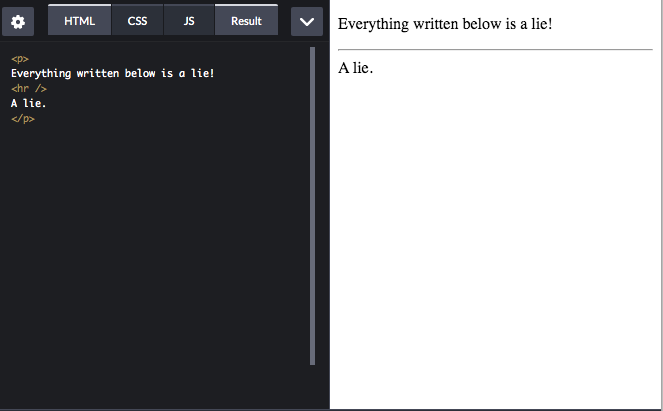
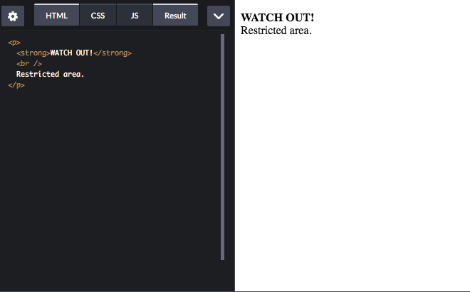
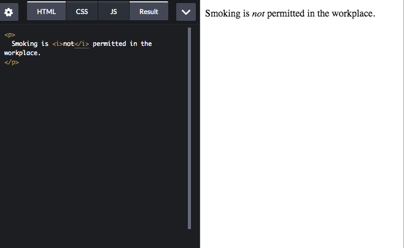
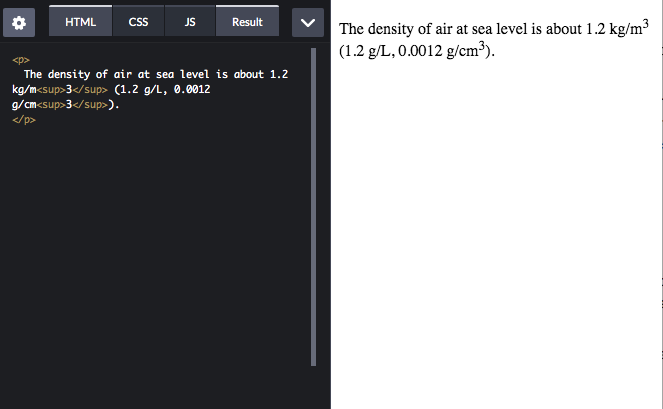
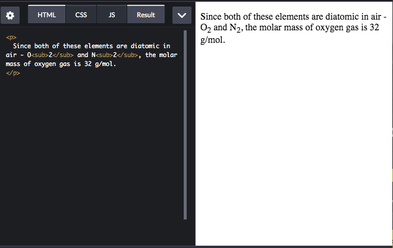

# Some HTML Tags
### Paragraph: `
`
It works when you want to make a paragraph. By default, the text begins on a new line.

- - - -
### Bold: `<b>`

### Italic: `<i>`

### Line break: ` `

### Horizontal rule: `
`

### Strong: `<strong>`

### Emphasis: `<em>`

### Superscript: ``

### Subscript: ``

