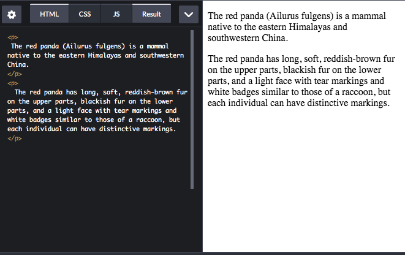

# Some HTML Tags
### Paragraph: `
`

### Bold: `<b>`

### Italic: `<i>`

### Line break: ` `

### Horizontal rule: `
`

### Strong: `<strong>`
### Emphasis: `<em>`
### Superscript: ``
### Subscript: ``
### Underlined: `<u>`
